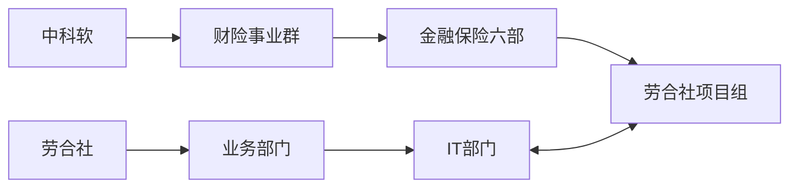

# 劳合社工作方法V1.0

## 背景：（2020-7-11）

我发现之前的想法是错误，按照项目组的角色、事项、方法来重新写一套。是一种很蠢的做法，因为目前项目中已有现行的体制、规范、以及已经有一部分方法了。我的工作在于汇总和整理，给出一个总述和指引。列出缺少的内容，然后补充这个资料库。

## 编写目的

对项目组的工作的推进和现有资料汇集，并作出综述，便于可以遵循已有的资源尽快找到解决问题的方法，并快速推进。作为项目组解决问题的一致外置大脑，外置知识库。

## 适合读者

劳合社项目组所有角色的参与人员，包括：PM、需求、开发、测试、QA等角色。

## 适用范围

工作实践适用：劳合社项目组面向“劳合社保险(中国)有限公司”客户的工作范围。

方法论适用：劳合社项目组团队内部的工作方法论。

## 项目团队以及客户

### 0.1. 客户背景

客户：劳合社保险（中国）有限公司

行业：保险行业

业务：财产保险，经营：直保、临分分入、合约再保分入、合约再保分出

劳合社中国官网：https://www.lloyds.com.cn/#/

劳合社伦敦官网：https://www.lloyds.com/

### 0.2. 项目组背景

公司：中科软科技股份有限公司

中科软官网：http://www.sinosoft.com.cn/

项目组：财险事业群-金融保险六部-劳合社项目组

提供的服务：负责支持劳合社业务开展过程信息系统的建设和维护

管理模式：按照阿米巴的管理模式进行全公司管理。劳合社中国将整个项目外包给中科软软件团队（劳合社项目组）进行处理。

### 0.3 项目团队

#### 团队角色组成：

1. 项目主管
2. PM项目经理
3. 开发：小组组长、普通开发人员、版本升级人员
4. 测试：测试组长、普通测试
5. 需求：需求分析师
6. 质量保证：QA

#### 团队各角色工作职责：
？？？待补充

#### 团队组织结构：

#### 团队人员清单：

【文档】<a href="../doc/项目人员清单20200701.xlsx" target="_blank">团队人员清单</a>

#### 微信工作讨论组

**组内:**

Lloyds Portal工作讨论组：日常工作讨论组

内部稽核讨论组：稽查稽核工作讨论组

loyd's 基站：项目管理讨论组

劳合社项目组Plus：中科软内隶属于劳合社团队的沟通组

进群方式：由项目组人员拉入

**组内+客户:**

劳合社核心运维沟通群：日常核心运维相关的沟通讨论组

Portal系统运维组：日常Portal系统运维讨论组

劳合社保单登记工作组：保单登记沟通讨论组

保险现场检查（稽核讨论）：稽查稽核沟通讨论组

进群方式：由项目组负责人同意后拉入

## 劳合社系统群

### 项目组的系统群

其中"运维"字段为"Y"的表示，由项目组负责进行新功能开发和系统运维：

|编号|系统名称|系统大类|运维|
|--|--|--|--|
|1|核心系统|业务|Y|
|2|Coverholder Portal系统|业务|Y|
|3|影像系统|支撑|Y|
|4|准备金系统|支撑|Y|
|5|外网查询系统|支撑|Y|
|6|增值税发票平台|业务|-|
|7|报表系统|业务|Y|
|8|SUN财务系统|业务|-|
|9|保单登记系统|监管|Y|
|10|保监上报系统|监管|Y|
|11|反洗钱系统|监管|Y|
|12|稽查稽核系统|监管|Y|
|13|保险公司服务评价|监管|Y|
|14|理赔服务质量|监管|Y|
|15|伦敦Xchanging系统|-|-|
|16|Synicate系统|-|-|
|17|邮件系统|-|-|

###  各系统和核心系统间的关系：

### 劳合社产品框架

# 1.综述方法论

概要说明，对我们项目组的定位以及项目组中角色的定位，我们工作的核心目标、以及我们的工作范围、以及我们基本的方法是什么样的？

## 目标

所有的一切从目标开始，知道了目标才知道努力的方向。  
我们所在的公司是“中科软科技股份有限公司”，是一件IT软件公司，可以给客户提供信息化系统建设服务。  
我们所服务的客户是“劳合社保险(中国)有限公司”，是一家保险公司（准确来说是一个保险市场），给中国境内客户提供保险服务。  
中科软服务境内、境外大量的保险公司客户，通过分事业群-部门-项目组的方式单独对接保险公司，对应到项目组就是“劳合社项目组”对接“劳合社”；而劳合社作为一个保险公司，外部有很多供应商，内部很多部门，主要通过IT部门来与项目组对接；两个公司形成了两个主体连接的桥梁，形成两者的联系，桥梁如下：  
[中科软]-->(财险事业群)-->(金融保险六部)-->(劳合社项目组)<======>(IT部门)<--业务部门<--[劳合社]

所以劳合社的目标是通过提供保险服务获得社会价值和收益，而我们项目组的目标是提供业务开展的信息化支持。

## 范围

项目组核心工作内容分为两类；  
应对新业务的开展：系统建设（新系统建设、新功能建设）  
应对已有业务的运行：系统运维（线上问题运维、系统使用咨询、以及其他系统过程中遇到的问题）  
以下内容如无特殊说明，所述内容为系统建设和系统运维。  

## 2.基本方法

我们要把工作中一个事情做正确、做好、高效率完成有很多方面要考虑。这里不做展开。  
我们先从做正确开始，做对的体现就是新系统建设能够满足客户的业务需要，UAT验收BUG极少。系统运维可快速解决问题。  
做正确事情的包括三个方面：面向过程-用正确的方法、面向结果-正确的目标、面向人-用正确的人。  

**【基本方法论：概述】**：  
我们项目团队(主体)，为解决一个问题(问题)，组织正确的人(资源)，使用正确的方法(方法论)，达成正确的目标(目标)，满足客户的需要(验证通过)。 

**【基本方法论：整体事项-软件工程思维】**  
1. 策划阶段：
- 接受问题  
-  评估工作量  
-  资源准备  
-  计划安排  
2. 方案阶段：
- 确定目标  
- 评估现状  
- 寻找差异  
- 针对差异制定解决方案并确认  
3. 实施阶段：
- 任务实施    
- 进度把控  
- 质量保证  
4. 验证阶段：
- UAT验收  
- 业务验收  

**【基本方法论：任务实施-团队协作任务实施思维】：**

我们是一个团队，借助团队能力完成工作。

从两个方面：
团队目标负责人，基本的工作方式是：
- 制定目标
- 制定/沿用工作流程（上下游对接方式）
- 进行工作任务拆解
- 进行工作量评估
- 制定工作计划和资源协调
- 任务讲解（目标、流程、任务、计划、准入准出标准）、培训、监控
- 工作产物的验证和汇集
- 工作任务的递交
  

团队成员，基本的工作方式是：
- 接受工作任务（目标、流程、任务、计划）
- 获取上游的准入工作成果
- 完成自己的工作任务
- 传递给下游准出的工作成果并验证通过
- 汇报目标负责人

